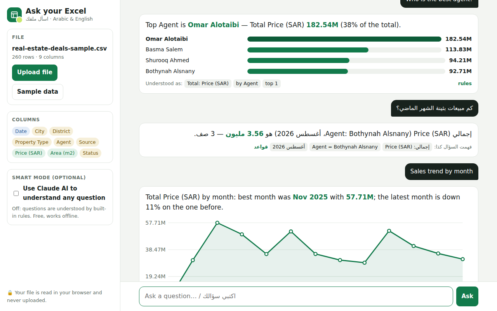
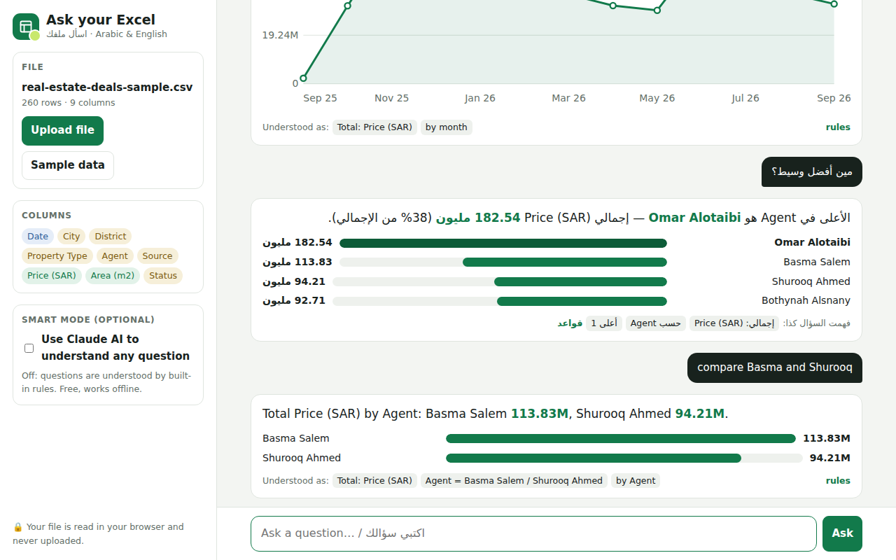

# Ask your Excel · اسأل ملفك

I work in real estate sales, and most of our numbers live in Excel sheets. Every week someone asks a quick question — *who closed the most deals this month? how much did we sell in Riyadh?* — and someone has to build a pivot table to answer it.

So I built this: upload the sheet, type the question in Arabic or English, get the answer.

**Try it:** https://noorsl.github.io/ask-your-excel/ (click **Try sample data**)

## Questions you can ask

- مين أفضل وسيط؟ / Who is the best agent?
- كم مبيعات بثينة الشهر الماضي؟
- How many deals are Won?
- متوسط السعر للفلل في جدة
- Sales trend by month
- Compare Riyadh and Jeddah / Top 3 districts by price

Under every answer there is a small line, **“Understood as”**, showing exactly what the tool calculated (for example *Total: Price · Agent = Bothynah · Aug 2026*). If it misunderstood you, you see it straight away.

## How it works

The question is turned into a small query plan — what to calculate, which filters, which period, grouped by what — and the plan runs on the data inside your browser.

Two ways to understand the question:

1. **Built-in rules (default).** Free and works offline. It knows words like total / average / how many / best / lowest in both languages, Arabic spelling variations (أ إ آ، ة، ال), months, and “last month / this year”. A small dictionary links Arabic and English values, so “الرياض” finds “Riyadh” and “الفلل” finds “Villa”.
2. **Smart mode with Claude (optional).** For any wording. You add your own API key; it is kept only in the open tab. Claude sees the column names and category values only — never the rows.

Your file is never uploaded anywhere.

## Notes

- Reads `.xlsx`, `.csv` and `.tsv` (old `.xls` → save as `.xlsx` first)
- No libraries: the `.xlsx` reader, charts and parsing are plain JavaScript
- The sample deals are made up

## Next

- Follow-up questions (“and in Jeddah?”)
- Percent change between two periods
- Save an answer as an image to share on WhatsApp

— Bothynah Alsnany · MIT License
